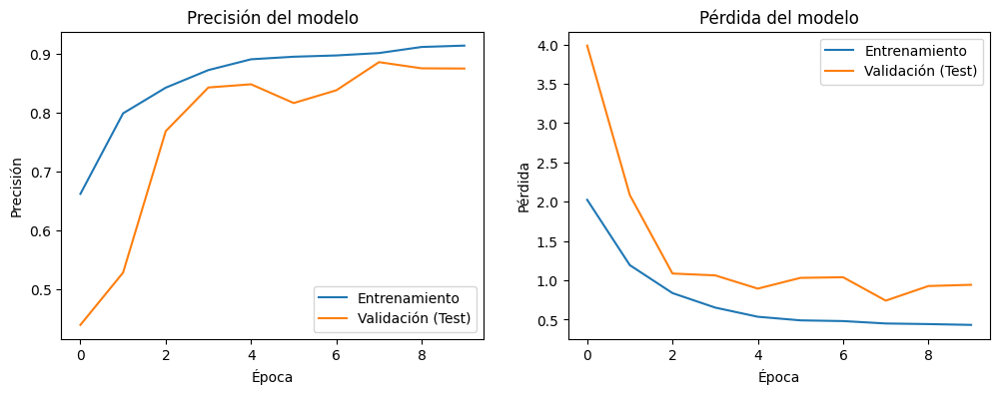
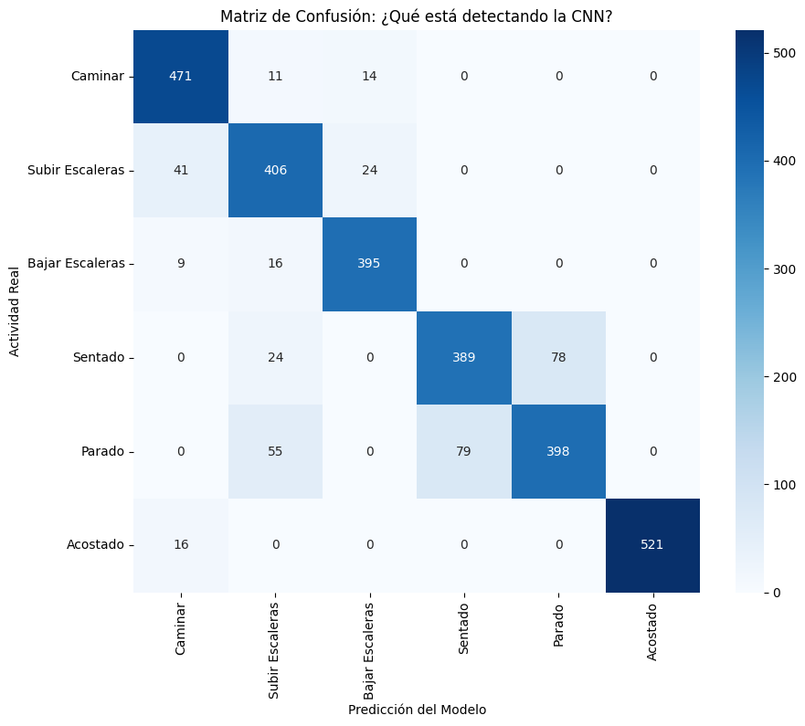
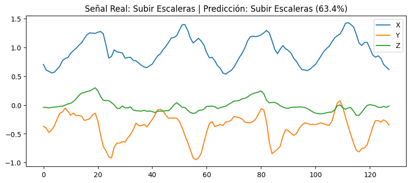
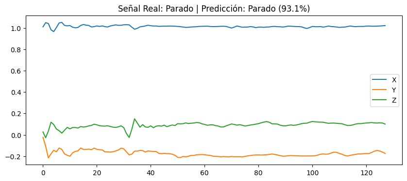
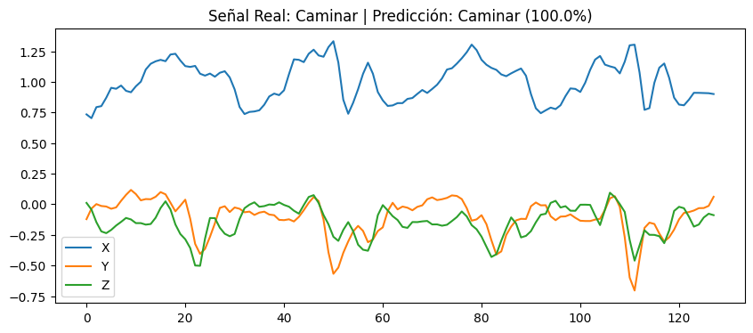
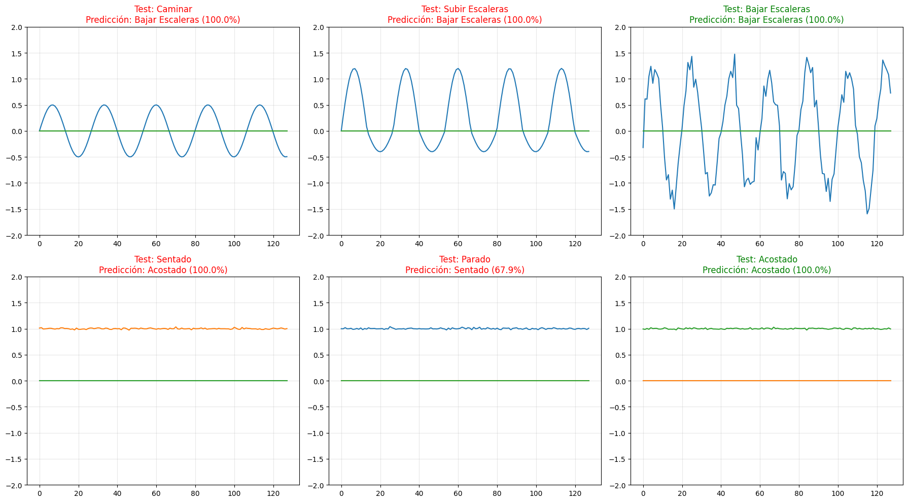

# Redes Neuronales CNN - Ejemplo con Sensores de Móvil

## 📱 Descripción del Proyecto

Este proyecto implementa un sistema de **Reconocimiento de Actividad Humana (HAR - Human Activity Recognition)** utilizando redes neuronales convolucionales (CNN) y datos de sensores de acelerómetros de teléfonos móviles. El sistema es capaz de clasificar 6 actividades humanas diferentes basándose en las lecturas de aceleración en tiempo real.

## 🎯 Objetivo

Demostrar el uso de redes neuronales convolucionales 1D (CNN 1D) para clasificar actividades humanas a partir de series temporales de datos de sensores, con aplicaciones en:
- Seguimiento de actividad física
- Monitoreo de salud
- Aplicaciones móviles conscientes del contexto
- Análisis de comportamiento

## 📊 Dataset

El proyecto utiliza el **UCI HAR Dataset** (UCI Machine Learning Repository), que contiene:

- **Datos de entrada**: Señales de aceleración total en 3 ejes (X, Y, Z) capturadas por acelerómetros de smartphones
- **Estructura**: 128 pasos temporales por muestra con 3 características (aceleración en 3 ejes)
- **Muestras**: ~7,300 muestras de entrenamiento y ~2,900 muestras de prueba
- **Fuente**: [UCI Machine Learning Repository](https://archive.ics.uci.edu/ml/datasets/human+activity+recognition+using+smartphones)

## 🏃 Actividades Clasificadas

El modelo puede reconocer las siguientes 6 actividades:

1. **Caminar** (Walking)
2. **Subir Escaleras** (Walking Upstairs)
3. **Bajar Escaleras** (Walking Downstairs)
4. **Sentado** (Sitting)
5. **Parado** (Standing)
6. **Acostado** (Lying Down)

## 🧠 Arquitectura del Modelo

Red Neuronal Convolucional 1D (CNN 1D) con la siguiente estructura:

```
- Capa Conv1D (32 filtros, kernel=3) + ReLU
- BatchNormalization
- MaxPooling1D
- Dropout (0.6)

- Capa Conv1D (32 filtros, kernel=3) + ReLU
- BatchNormalization  
- MaxPooling1D
- Dropout (0.5)

- Flatten
- Capa Densa (100 neuronas) + ReLU + Regularización L2
- Capa de Salida (6 neuronas) + Softmax
```

**Rendimiento**: El modelo alcanza aproximadamente **86.8% de precisión** en el conjunto de validación después de 10 épocas.

## 📈 Resultados

### Precisión del Modelo



Esta gráfica muestra la evolución de la precisión del modelo durante el entrenamiento:
- **Línea azul**: Precisión en el conjunto de entrenamiento
- **Línea naranja**: Precisión en el conjunto de validación

El modelo converge rápidamente y mantiene un buen equilibrio entre el entrenamiento y la validación, indicando que no hay sobreajuste significativo.

### Matriz de Confusión



La matriz de confusión muestra el rendimiento del modelo para cada actividad:
- Las actividades estáticas (sentado, parado, acostado) se clasifican con alta precisión
- Las actividades dinámicas (caminar, subir/bajar escaleras) también muestran buena precisión
- La diagonal principal muestra una fuerte concentración, indicando clasificaciones correctas

### Ejemplos de Predicción

#### Ejemplo 1


Señal de aceleración para la actividad "Caminar". El modelo predice correctamente la actividad basándose en los patrones periódicos característicos del caminar.

#### Ejemplo 2


Señal de aceleración para otra actividad. Observe cómo los patrones de aceleración difieren significativamente entre actividades.

#### Ejemplo 3


Tercer ejemplo de clasificación mostrando la capacidad del modelo para distinguir entre diferentes patrones de movimiento.

### Prueba con Datos Sintéticos



Validación del modelo utilizando datos sintéticos generados artificialmente para cada actividad:
- **Caminar**: Señal periódica con amplitud moderada
- **Subir Escaleras**: Mayor variabilidad y amplitud
- **Bajar Escaleras**: Patrón descendente con picos
- **Sentado**: Señal casi constante con mínima variación
- **Parado**: Pequeñas fluctuaciones alrededor de un valor constante
- **Acostado**: Señal prácticamente plana

El modelo es capaz de clasificar correctamente incluso estas señales sintéticas simplificadas.

## 🚀 Uso

### Requisitos

```python
pip install pandas numpy tensorflow requests
```

### Ejecución

1. Abre el notebook `CNN-SensorAceleraciónTLFMóvil.ipynb` en Google Colab o Jupyter Notebook
2. Ejecuta todas las celdas secuencialmente:
   - **Celda 1**: Descarga y preparación de datos
   - **Celda 2**: Definición del modelo CNN
   - **Celda 3**: Entrenamiento del modelo
   - **Celda 4**: Visualización de resultados
   - **Celda 5**: Evaluación con datos sintéticos

### Proceso Paso a Paso

1. **Descarga de Datos**: El notebook automáticamente descarga el dataset UCI HAR
2. **Preprocesamiento**: Los datos se cargan y se convierten al formato apropiado
3. **Entrenamiento**: El modelo se entrena durante 10 épocas
4. **Evaluación**: Se generan gráficas de precisión y matriz de confusión
5. **Validación**: Se prueban señales sintéticas para verificar el comportamiento del modelo

## 🔧 Tecnologías Utilizadas

- **Python 3.x**
- **TensorFlow/Keras**: Framework de deep learning
- **NumPy**: Cálculos numéricos
- **Pandas**: Manipulación de datos
- **Matplotlib/Seaborn**: Visualización de resultados

## 📝 Notas Técnicas

### Ventajas de CNN 1D para Series Temporales

- **Detección automática de características**: No requiere ingeniería manual de características
- **Invarianza temporal**: Puede detectar patrones en diferentes posiciones de la señal
- **Eficiencia computacional**: Más rápido que CNNs 2D para series temporales
- **Generalización**: Buen rendimiento con datos nuevos

### Técnicas de Regularización Implementadas

- **Dropout**: Reduce el sobreajuste desactivando neuronas aleatoriamente
- **Regularización L2**: Penaliza pesos grandes para mejorar la generalización
- **BatchNormalization**: Estabiliza el entrenamiento y acelera la convergencia

## 🎓 Aplicaciones Potenciales

- Aplicaciones de fitness y salud
- Monitoreo de personas mayores
- Detección de caídas
- Análisis de patrones de comportamiento
- Optimización del consumo energético en dispositivos móviles
- Interfaces humano-computadora adaptativas

## 📚 Referencias

- [UCI HAR Dataset](https://archive.ics.uci.edu/ml/datasets/human+activity+recognition+using+smartphones)
- [Convolutional Neural Networks for Time Series Classification](https://arxiv.org/abs/1611.06455)

## 👨‍💻 Autor

SebastianCanQue

## 📄 Licencia

Este proyecto es de código abierto y está disponible para fines educativos.

---

**¿Tienes preguntas o sugerencias?** No dudes en abrir un issue o contribuir al proyecto.
